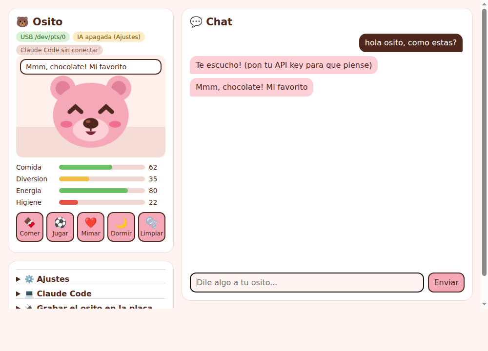

# 🐻 Tamagotchi del Osito (ESP32 + pantalla)

Un osito rosa con **ojos en X de chocolate** y **nariz de chocolate** que vive en tu ESP32.
Hay que darle chocolate, jugar con él, mimarlo, dormirlo y limpiarle las caquitas.

**Lo más fácil:** enchufa la placa por USB y abre **`Osito.bat`** → se abre la app
(chat con el osito, barras en vivo, botones, grabar firmware, conectar Claude Code).
Guía: [`PROBAR.md`](PROBAR.md).



Placas soportadas:

| Placa | Archivo listo para grabar | Controles |
|---|---|---|
| **Cheap Yellow Display** ESP32-2432S028R (2.8" 320x240 táctil) | `firmware/osito-cyd.bin` | Pantalla táctil + botón BOOT |
| **TTGO T-Display** (1.14" 240x135) | `firmware/osito-tdisplay.bin` | Botón izq. = siguiente, der. = aceptar |
| ESP32 DevKit + ILI9341 SPI cableado a mano | `firmware/osito-generic.bin` | Pulsadores en GPIO27 / GPIO26 |

---

## 1. Driver USB (Windows)

La ESP32 se conecta por un chip USB-serie. Mira el chip pequeño cerca del conector USB
o el **Administrador de dispositivos → Puertos (COM y LPT)**:

- **CH340 / CH341** (el de la mayoría de CYD y placas chinas):
  <https://www.wch-ic.com/downloads/CH341SER_EXE.html>
- **CP2102 / CP210x** (Silicon Labs):
  <https://www.silabs.com/developers/usb-to-uart-bridge-vcp-drivers>

Tras instalarlo, al conectar la placa debe aparecer un **COMx** en "Puertos (COM y LPT)".
Si no aparece nada: prueba otro cable USB (muchos cables solo cargan, no llevan datos).

> El driver *DsHidMini* es para mandos de PS3, **no hace falta** para la ESP32.

## 2. Grabar el osito (elige UNA forma)

### Opción A — Desde el navegador (sin instalar nada) ⭐

1. Descarga el `.bin` de tu placa desde la carpeta [`firmware/`](firmware/).
2. Abre **Chrome o Edge** en <https://espressif.github.io/esptool-js/>
3. Baudrate `460800` → **Connect** → elige el puerto COM de la ESP32.
   (Si no conecta: mantén pulsado **BOOT** en la placa mientras le das a Connect.)
4. En *Flash Address* pon **`0x0`**, elige el archivo `.bin` y pulsa **Program**.
5. Cuando termine, pulsa **RST/EN** en la placa. ¡Hola osito!

### Opción B — Script de Windows

Con Python instalado, doble clic en `flashear.bat` (o desde una terminal):

```bat
flashear.bat            :: Cheap Yellow Display
flashear.bat tdisplay   :: TTGO T-Display
```

### Opción C — Compilar tú mismo (PlatformIO)

```bash
pip install platformio
pio run -e cyd -t upload        # o -e tdisplay / -e generic
pio device monitor              # ver mensajes por serie
```

## 3. Cómo se juega

- Barras arriba: **COM**ida, **DIV**ersión, **ENE**rgía, **HIG**iene.
- Menú abajo: 🍫 Comer · ⚽ Jugar · ❤️ Mimar · 🌙 Dormir · 🫧 Limpiar.
- **Táctil (CYD):** toca un icono para usarlo. Toca la cabeza del osito para mimarlo,
  tócale la **nariz de chocolate** y se relame.
- **Botones:** A = siguiente opción, B = aceptar.
- Mantener **BOOT / botón A 4 segundos** = osito nuevo.
- Después de comer hace caquitas: si no las limpias baja la higiene.
- Si lo descuidas mucho **se pone malito** (nariz derretida), pero no muere:
  se cura cuidándolo.
- Se guarda solo cada minuto (memoria NVS), sobrevive a apagarlo.

## 4. Problemas típicos

| Síntoma | Solución |
|---|---|
| Pantalla en blanco | Placa distinta: prueba otro `.bin` o ajusta pines en `platformio.ini` |
| Colores invertidos (CYD) | Añade `-DTFT_INVERSION_ON=1` (o `OFF`) en `[env:cyd]` y recompila |
| Imagen rara en CYD de 2 USB | Cambia `ILI9341_2_DRIVER` por `ST7789_DRIVER` |
| Los toques caen en otro sitio | Ajusta `TOUCH_X_MIN/MAX`, `TOUCH_Y_MIN/MAX` en `include/config.h` |
| Pantalla del revés | `-DSCREEN_ROTATION=3` en build_flags |

## Personalizar

Todo en [`include/config.h`](include/config.h): nombre (`PET_NAME`), velocidad del hambre,
sueño, etc.

## 5. Cerebro con IA (Claude) 🧠

El osito puede hablar con personalidad propia usando Claude. La API key **nunca**
va en la placa: vive en un pequeño servidor en tu PC (arquitectura "puente").

```
 [ESP32 osito] --WiFi--> [bridge/servidor.py en tu PC] --internet--> [Claude]
     evento + barras          personalidad + memoria            frase + emocion
```

1. **Arranca el servidor** en el PC (misma WiFi que la placa):
   - Windows: doble clic en `bridge/iniciar_servidor.bat` y pega tu API key
     (<https://console.anthropic.com/settings/keys>). Sin key funciona en modo prueba.
   - Linux/Mac: `cd bridge && pip install -r requirements.txt && ANTHROPIC_API_KEY=sk-... python servidor.py`
   - Al arrancar imprime la dirección, p. ej. `http://192.168.1.50:8765`.
2. **Conecta la placa al WiFi**: la primera vez el osito crea la red **`Osito-Config`**.
   Conéctate desde el móvil, abre <http://192.168.4.1> y rellena tu WiFi (2.4 GHz),
   la dirección del servidor y el token (`osito` por defecto). Se reinicia solo.
   *(Si compilas tú mismo, también puedes copiar `include/secrets.example.h` a `include/secrets.h`.)*
3. Punto en la esquina de la pantalla: 🟢 conectado · 🟡 portal de configuración · 🔴 sin WiFi.

Qué hace:
- Cada vez que lo alimentas, juegas, lo mimas, le tocas la nariz o lo acuestas, Claude
  escribe su frase según cómo está (hambre, sueño, suciedad...) y elige su cara
  (feliz, triste, sorprendido, con sueño, enamorado).
- Si necesita algo, lo pide; cuando está bien, de vez en cuando piensa en voz alta.
- **Escríbele**: abre la dirección del servidor en el navegador del móvil/PC, escribe
  algo y su respuesta aparece en la pantalla del osito.
- Recuerda sus últimas 30 frases (`bridge/memoria.json`) para no repetirse.

Ajustes del servidor (variables de entorno): `OSITO_NOMBRE`, `OSITO_TOKEN`,
`OSITO_PUERTO` y `OSITO_MODELO` (por defecto `claude-opus-5`; `claude-haiku-4-5` es
más barato si lo prefieres).

## 6. El osito vigila a Claude Code 💻

Con los hooks de Claude Code el osito sigue en vivo lo que hace tu agente:
saca un portátil cuando Claude piensa, muestra la herramienta que usa (`Edit main.cpp`),
salta con un **"!"** cuando Claude te pide permiso (tócalo para calmarlo) y lanza
**confeti** cuando termina.

- Probar sin Claude Code: `python bridge/probar_agente.py`
- Conectar de verdad: `bridge/conectar_claude_code.bat` (o `python bridge/instalar_hooks.py`),
  y abre una sesión nueva de Claude Code. Quitar: `--quitar`.

👉 Guía de pruebas paso a paso: [`PROBAR.md`](PROBAR.md)
